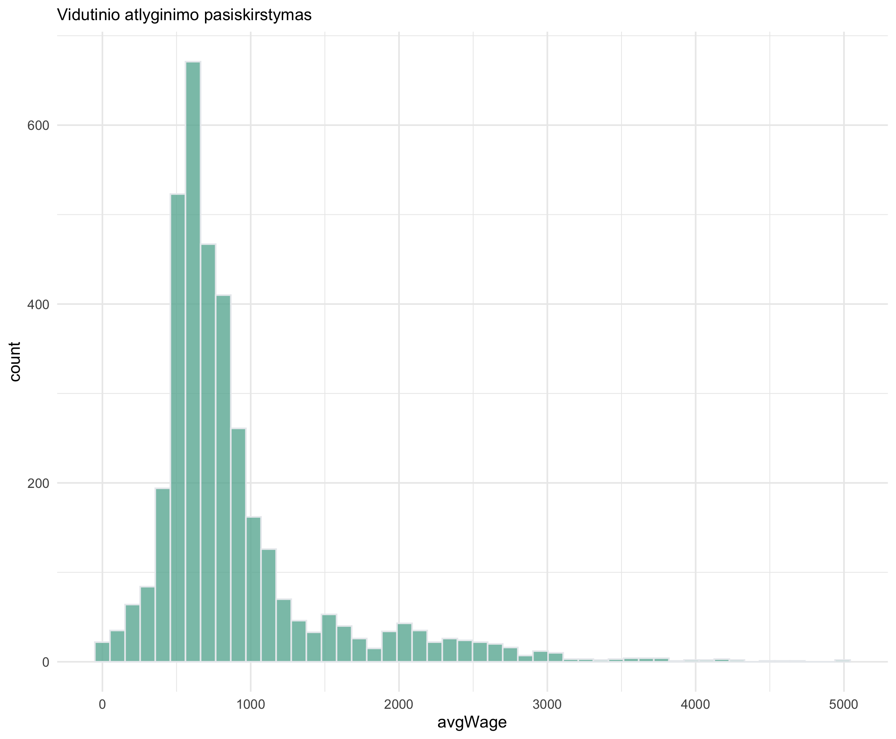
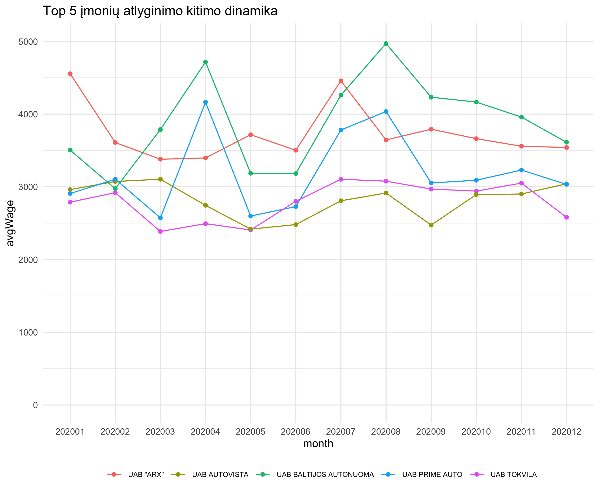
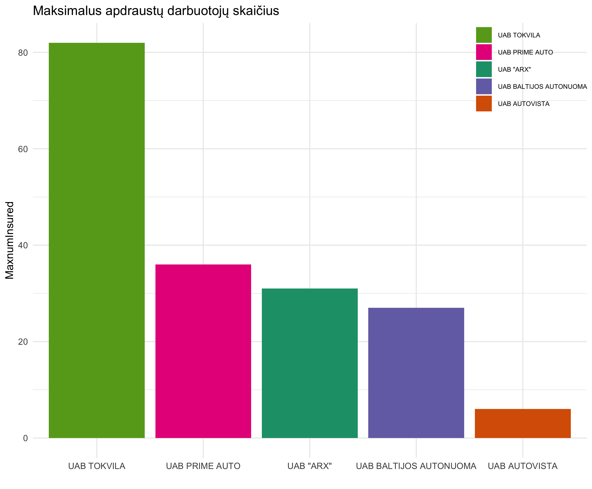
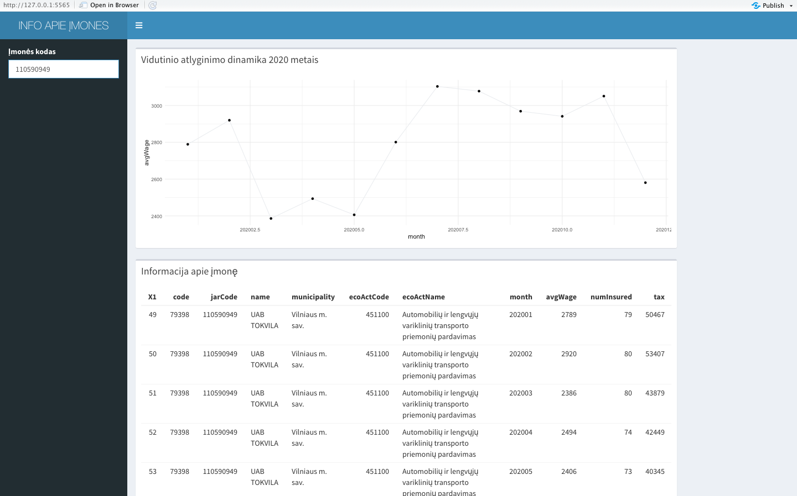

# R Laboratorinis darbas: duomenų vizualizacija

| Variantas | ecoActCode |
|------------- | ------------- |
|17   | 451100 |

### 1. Užduotis

Atsakymas:

Išvados: Iš histogramos matyti, jog tarp Automobilių ir lengvųjų variklinių transporto priemonių pardavimo veikla užsiimančių įmonių didžiausias vidutinio mėn. atlyginimo pasiskirstymas buvo ~600-700 eurų ribose. (Data skewed to the right, t.y. atlyginimų vidurkis didesnis už atlyginimų medianą). 

### 2. Užduotis

Atsakymas:

Išvados: Top 5 įmonės, užsiimančios Automobilių ir lengvųjų variklinių transporto priemonių pardavimo veikla ir 2020 metais mokėjusios didžiausią vidutinį darbo užmokestį, yra šios: 
 
1. UAB Baltijos Autonuoma - 3879 eurų vid. atlyginimas;
2. UAB "Arx" - 3735 eurų;
3. UAB Prime Auto - 3192 eurų;
4. UAB Autovista - 2818 eurų;
5. UAB Tokvila - 2793 eurų.

Grafike matyti sąlyginai dideli (daugiau nei 1000 eurų) Top 3 įmonių vidutinio mėn. atlyginimo svyravimai 2020 metais.

### 3. Užduotis

Atsakymas:

Išvados: Maksimalus apdraustų darbuotojų skaičius Top 5 įmonėse (pagal 2020 metais mokėtą didžiausią vidutinį darbo užmokestį) buvo toks:

1. UAB Tokvila - 82 darbuotojai;
2. UAB Prime Auto - 36 darbuotojai;
3. UAB "Arx" - 31 darbuotojas;
4. UAB Baltijos Autonuoma - 27 darbuotojai;
5. UAB Autovista - 6.

### 4. Užduotis

Shiny R aplikacijos nuotrauka:

